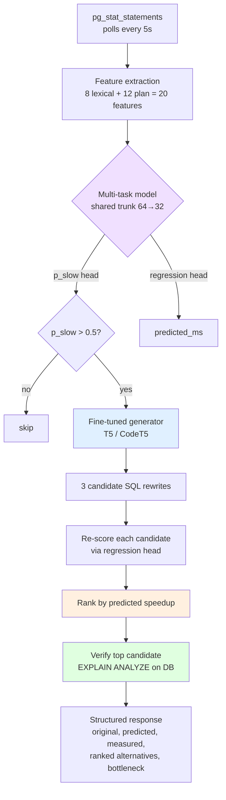

```mermaid
flowchart TD
    A[pg_stat_statements<br/>polls every 5s] --> B[Feature extraction<br/>8 lexical + 12 plan = 20 features]
    B --> C{Multi-task model<br/>shared trunk 64→32}
    C -->|p_slow head| D{p_slow > 0.5?}
    C -->|regression head| H[predicted_ms]
    D -->|no| Z[skip]
    D -->|yes| E[Fine-tuned generator<br/>T5 / CodeT5]
    E --> F[3 candidate SQL rewrites]
    F --> G[Re-score each candidate<br/>via regression head]
    G --> I[Rank by predicted speedup]
    I --> J[Verify top candidate<br/>EXPLAIN ANALYZE on DB]
    J --> K[Structured response<br/>original, predicted, measured,<br/>ranked alternatives, bottleneck]

    style C fill:#f0e0ff
    style E fill:#e0f0ff
    style I fill:#fff0e0
    style J fill:#e0ffe0
```