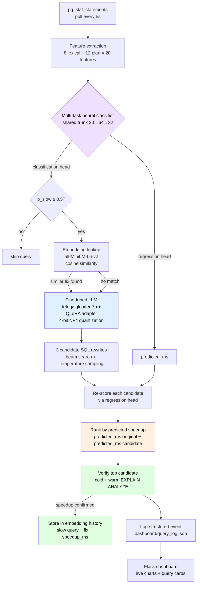

# System Architecture
Download mermaid preview extension for markdown files to be able to see this file correctly!

## Component summary

| Stage | Component | File |
|---|---|---|
| 1. Detection | pg_stat_statements poll | `monitor/monitor.py` |
| 2. Feature extraction | Lexical + EXPLAIN ANALYZE | `classifier/inference.py` |
| 3. Classification | Multi-task PyTorch model | `classifier/classifier.py` |
| 4. Memory lookup | Sentence-transformer similarity | `embeddings/embeddings.py` |
| 5. Rewrite generation | sqlcoder-7b QLoRA fine-tune | `finetune/llm_optimizer.py` |
| 6. Ranking | Regression head re-scoring | `classifier/inference.py` |
| 7. Verification | Cold + warm DB timing | `monitor/monitor.py` |
| 8. Storage | Embedding history + JSON log | `embeddings/embeddings.py` |
| 9. Visualisation | Flask + Chart.js dashboard | `dashboard/app.py` |
